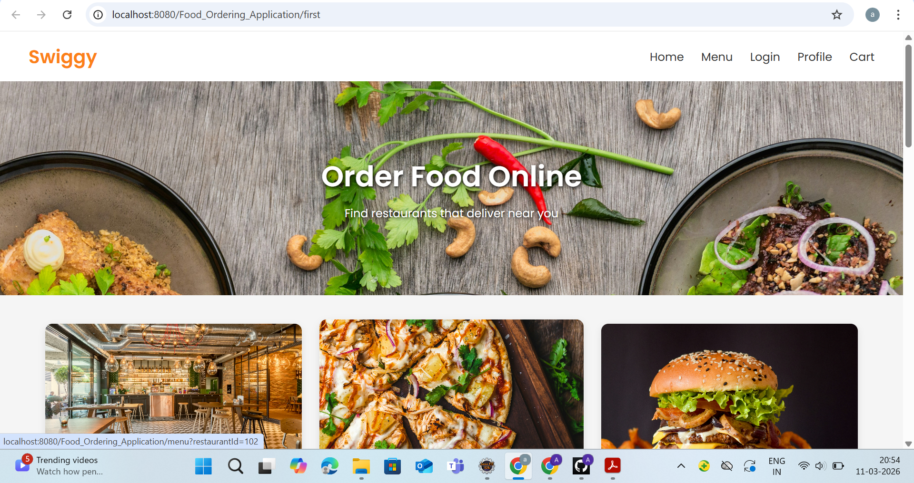
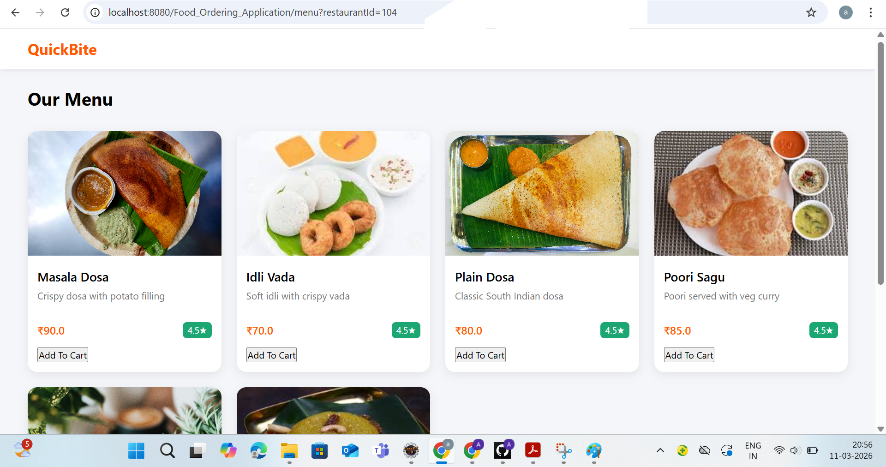
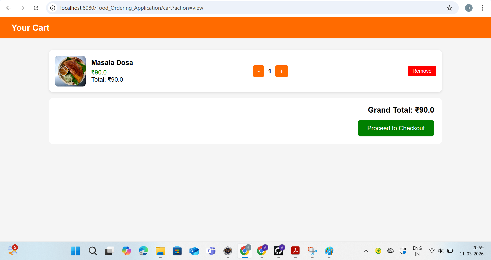
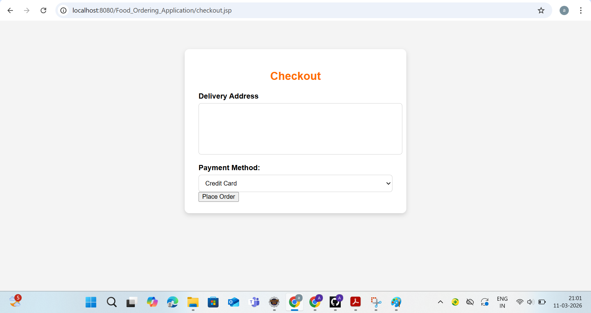

🍽️ Food_Ordering_System

A simple web-based food ordering application built using Java (JSP/Servlets), JDBC, and MySQL, inspired by platforms like Swiggy and Zomato.
The application allows users to browse restaurants, view menus, add food items to the cart, and place orders through an interactive interface.

🔧 Tech Stack

Java (JDK 8+)

JSP & Servlets (JEE)

JDBC

MySQL

HTML

CSS

Apache Tomcat (v9+)

🌟 Features

👤 User Registration & Login

🍔 View Restaurants and Menus

🛒 Add Items to Cart

➕ Increase / Decrease Cart Quantity

💳 Place Orders with Payment Option (Cash/Card)

🧾 Order Confirmation Page

📦 Manage Cart Items

📌 Project Structure
FoodOrderingSystem/
│
├── src/
│   ├── model/
│   ├── dao/
│   ├── servlet/
│
├── web/
│   ├── jsp/
│   ├── css/
│   ├── images/
│
├── lib/
├── sql/
├── README.md
├── .gitignore
└── web.xml
🖼️ System Architecture
+------------+      +---------------------+     +--------------+
|   User     | ---> |  JSP / HTML Pages   | <-->|   Servlet    |
+------------+      +---------------------+     +--------------+
                                                |   DAO Layer  |
                                                +--------------+
                                                       |
                                                       v
                                                +--------------+
                                                |   MySQL DB   |
                                                +--------------+
🚀 How to Run the Project
✅ Prerequisites

JDK 8 or higher

Apache Tomcat 9 or later

MySQL Server

IDE: Eclipse / IntelliJ IDEA

MySQL JDBC Connector

💡 Steps to Run the Project
1️⃣ Clone the Repository
git clone https://github.com/Aishwarya/Food_Ordering_System.git
2️⃣ Import the Project

Open Eclipse / IntelliJ

Import as Dynamic Web Project

3️⃣ Configure Database

Create a database in MySQL

food_ordering_db

Update database credentials in your DB connection file.

String url = "jdbc:mysql://localhost:3306/food_ordering_db";
String username = "root";
String password = "yourpassword";
4️⃣ Add JDBC Driver

Add mysql-connector-java.jar inside the lib folder.

5️⃣ Deploy on Tomcat

Add project to Tomcat Server

Start the server

6️⃣ Run the Application

Open browser and run:

http://localhost:8080/FoodOrderingSystem/
📷 Screenshots

🏠 Home Page
## 📷 Screenshots

### 🏠 Home Page

### 🍽️ Restaurant Menu

### 🛒 Cart Page

### 💳 Checkout Page

👩‍💻 Author
Aishwarya SS

💼 Aspiring Java Full Stack Developer
Passionate about building web applications using Java technologies

📫 Contact

📧 Email: aishwaryass157@gmail.com
